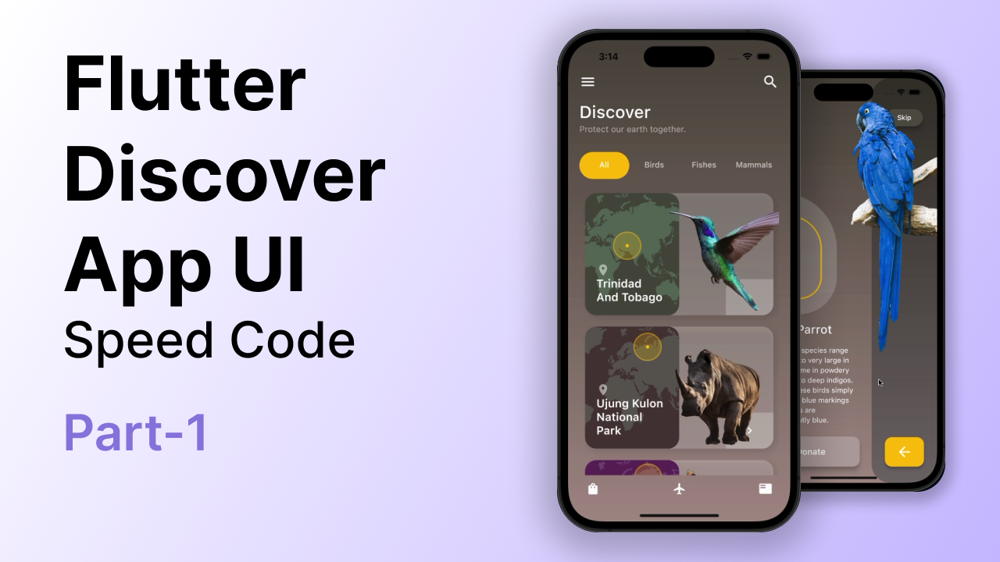

# Discover_flutter_ui

## Getting Started

Nice clean discover app #UI using #flutter to showcase animals and their beauty, the Home page you will get search icon than a horizontal list of all Categories of animals in the discover app with a tab view.
Then the user can also swipe left/right and tap on the categories button to navigate between other categories of animals.

# [Watch it on YouTube ](https://youtu.be/3_W5BW2aqCQ)

# [Watch it on Instagram ](https://instagram.com/strength_code)

## Project Created by
### Shahbaj Jamil
 #Flutter, #Android Developer, #ios.
 
         

